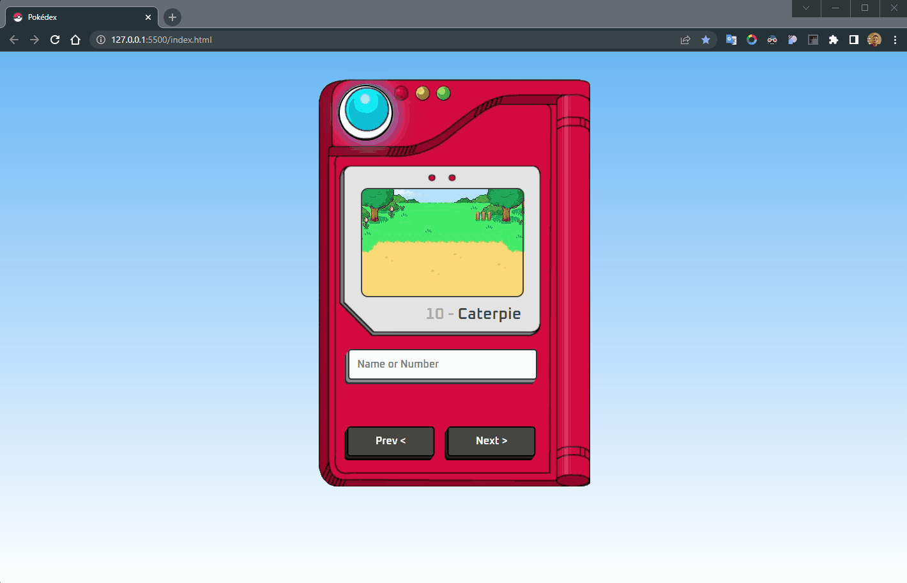

<h1 align="center">Pokédex</h1>

         
        

 
 
 
 

<h2 id="the_challenge"  align="center">⚡ The Challenge  </h2>

   
Simple project to have fun with your nephew, creating a <b>pokédex</b> with JavaScript, Vanilla, HTML and CSS

 
 

<h2 id = "author" align="center"></h2>

<table align="center">
  <tr>
      <td>
      <a href="https://github.com/gabriel-durr">
         
      </a>
      </td>
  </tr>
</table>

<b><em>Made with 💜&ensp;by Gabriel Dürr</em></b>

<h3 id="license" ></h3>

> This project is licensed under the &nbsp; 

